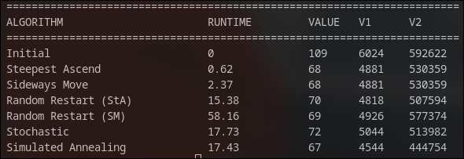
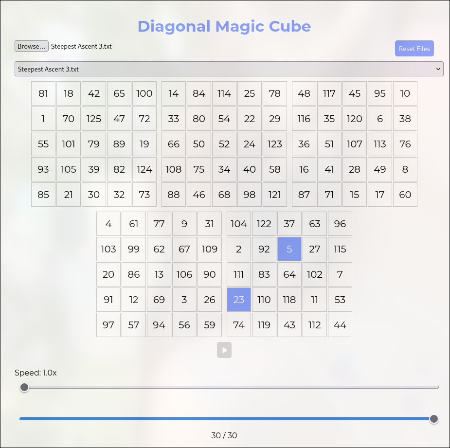

# LocalSearch

## Capture


## Description
Implementation of Local Search to solve **diagonal magic cube of 5\*5\*5 dimension** using Go programming language and OOP-like paradigm. Upon running, it generates plot relevant to the algorithm and dump files of cubes' states that can be visualized on the web via HTML, CSS, and JS.

The implemented algorithm:
- Steepest Ascent Hill-climbing
- Hill-climbing with Sideways Move
- Random Restart Hill-climbing, using Steepest Ascent Hill-climbing and Hill-climbing with Sideways Move
- Stochastic Hill-climbing
- Simulated Annealing
- Genetic Algorithm

Course: IF3070 Foundation of Artificial Intelligence
Institut Teknologi Bandung

## Requirements
- Installed Go

## How to Use (Run)
- Clone this repository

```
git clone https://github.com/gracialy/LocalSearch.git
```

- Change directory to the clone

```
cd LocalSearch
```

- If you're having problem with GOPROXY, set (global)

```
export GOPROXY=https://goproxy.io
```

- Run Go & experiment

```
go run main.go cube.go experiment.go steepest_ascent.go sideways_move.go stochastic.go rr_sideways.go rr_steepest.go simulated_annealing.go genetic_algorithm.go
```

- Open `index.html ` from your file manager
- Upon generating any experiment dump file, upload your dump file to the web.


## How to Use (Alternative)
To skip the hassle, execute the binary provided

```
./bin/localsearch
```